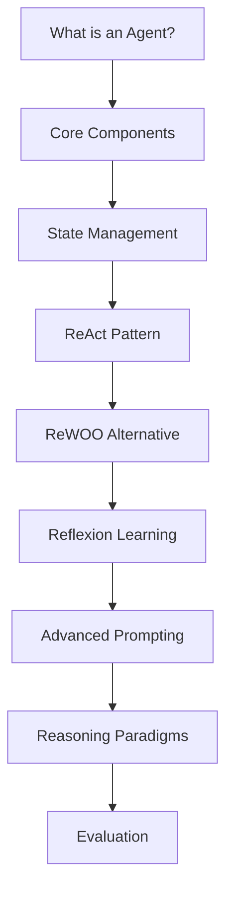

# 📚 AgentStarterKit Course Overview

## 🎯 Course Mission

Transform developers into autonomous AI system architects through hands-on, progressive learning that bridges theory and production-ready implementations.

---

## 🌟 Why This Course?

The AI landscape is rapidly shifting from simple prompt-response interactions to sophisticated autonomous agents. This course addresses the critical gap between:

- **Current State**: Developers using LLMs as simple Q&A tools
- **Future Need**: Building agents that perceive, reason, plan, and act autonomously

### Market Demand
- 🚀 **87% growth** in demand for AI agent developers (2024)
- 💰 **$150k+ average salary** for autonomous systems engineers
- 🏢 **Every major tech company** investing in agent architectures

---

## 🧭 Learning Journey

### Phase 1: Foundation (Chapter 1)
**Goal**: Build mental models for autonomous systems

Starting from first principles, you'll understand what separates an "agent" from traditional software:
- **Autonomy**: Systems that make decisions without constant human oversight
- **Adaptability**: Learning from experience and improving over time
- **Goal-Orientation**: Working towards objectives, not just responding to commands

### Phase 2: Intelligence (Chapters 1-2)
**Goal**: Implement reasoning and memory systems

Moving beyond basic automation to true intelligence:
- **Reasoning Patterns**: ReAct, ReWOO, Reflexion for structured thinking
- **Memory Architecture**: Working, episodic, semantic, and procedural memory
- **Learning Mechanisms**: Experience replay and performance optimization

### Phase 3: Integration (Chapter 3)
**Goal**: Connect agents to real-world systems

Bridging the gap between prototype and production:
- **Tool Frameworks**: Robust integration patterns
- **Error Resilience**: Handling failures gracefully
- **Security**: Safe interaction with external systems

### Phase 4: Autonomy (Chapter 4)
**Goal**: Build truly autonomous systems

The culmination - agents that plan and execute complex workflows:
- **Hierarchical Planning**: Breaking down complex goals
- **Adaptive Execution**: Adjusting plans based on outcomes
- **Multi-Goal Optimization**: Balancing competing objectives

---

## 🎓 Pedagogical Approach

### Learning Principles

1. **Progressive Complexity**
   - Start simple, build foundations
   - Each concept prepares for the next
   - No knowledge gaps or jumps

2. **Immediate Application**
   - Every concept has working code
   - Run examples as you learn
   - See results in real-time

3. **Production Focus**
   - Learn patterns used in industry
   - Handle edge cases and errors
   - Build robust, maintainable systems

4. **Active Learning**
   - 70% hands-on coding
   - Guided exercises with templates
   - Debug and fix intentional errors

### Course Structure

```
Theory (30%) ──┐
               ├── Integrated Learning Experience
Practice (70%) ┘

Each Module:
├── Conceptual Introduction (5-10 min)
├── Live Coding Examples (15-20 min)
├── Guided Exercises (15-20 min)
└── Challenge Problems (10-15 min)
```

---

## 📊 Detailed Module Breakdown

### Chapter 1: Agent Foundations

#### Module Flow


#### Key Concepts by Notebook

**1. What is an Agent? (01_what_is_an_agent.ipynb)**
- Definition: Autonomous, goal-oriented systems
- Components: Perception → Reasoning → Action
- Examples: From simple chatbots to complex planners
- Hands-on: Build a minimal agent in 50 lines

**2. Agent Foundations (01_agent_foundations.ipynb)**
- Architecture patterns for maintainable agents
- State management and persistence
- Tool integration basics
- Error handling and recovery
- Project: Weather advisory agent

**3. ReAct Pattern (02_react_pattern.ipynb)**
- Reasoning + Acting framework
- Thought → Action → Observation loops
- Implementation with trace logging
- Common failure modes and fixes
- Exercise: Multi-step math problem solver

**4. ReAct vs ReWOO (03_react_vs_rewoo.ipynb)**
- ReWOO: Plan first, execute later
- Performance comparison
- Use case analysis
- Hybrid approaches
- Lab: Implement both for the same task

**5. Reflexion Pattern (04_reflexion_pattern.ipynb)**
- Self-reflection and improvement
- Learning from failures
- Memory integration
- Performance tracking
- Project: Self-improving code generator

**6. Advanced Prompting (05_advanced_prompting.ipynb)**
- 58 techniques from research papers:
  - Chain-of-Thought variants
  - Self-Consistency
  - Tree of Thoughts
  - Program-aided Language Models
  - Constitutional AI methods
- Comparative analysis
- When to use each technique
- Challenge: Prompt optimization tournament

**7. Reasoning Paradigms (06_reasoning_paradigms.ipynb)**
- Multi-agent debate systems
- Self-verification chains
- Recursive reasoning
- Ensemble methods
- Capstone: Build a reasoning framework

**8. Evaluation Basics (07_evaluation_basics.ipynb)**
- Metrics for autonomous systems
- A/B testing frameworks
- Performance tracking
- User satisfaction measures
- Tool: Agent benchmarking suite

### Chapter 2: Memory and Learning

**Core Architecture**:
```python
class MemorySystem:
    working_memory: ShortTermStore      # Current context
    episodic_memory: ExperienceStore    # Past interactions
    semantic_memory: KnowledgeBase      # Facts and concepts
    procedural_memory: SkillLibrary     # How-to knowledge
```

**Learning Outcomes**:
- Implement four-tier memory system
- Build experience replay mechanisms
- Create performance optimization loops
- Design forgetting strategies
- Project: Learning agent for task automation

### Chapter 3: Tool Integration

**Production Patterns**:
- Robust tool frameworks with validation
- Database CRUD operations
- RESTful API integration
- File system management
- Async operation handling
- Security and sandboxing

**Real-World Project**: 
Build an agent that:
- Monitors GitHub repositories
- Analyzes code changes
- Generates summaries
- Posts updates to Slack
- Learns from user feedback

### Chapter 4: Planning and Goals

**Advanced Concepts**:
- Hierarchical Task Networks (HTN)
- Goal decomposition algorithms
- Plan synthesis and validation
- Execution monitoring
- Adaptive replanning
- Resource optimization

**Culmination Project**:
Autonomous project manager that:
- Takes high-level objectives
- Breaks down into tasks
- Assigns priorities
- Tracks progress
- Adjusts plans based on results
- Reports status updates

---

## 🏗️ Capstone Project Ideas

### Beginner Level
1. **Personal Assistant Agent**
   - Manages todos and calendar
   - Learns user preferences
   - Suggests optimizations

2. **Code Review Agent**
   - Analyzes pull requests
   - Suggests improvements
   - Learns from accepted changes

### Intermediate Level
3. **Research Assistant**
   - Searches multiple sources
   - Synthesizes findings
   - Maintains knowledge base
   - Generates reports

4. **DevOps Automation Agent**
   - Monitors system health
   - Predicts issues
   - Executes fixes
   - Documents actions

### Advanced Level
5. **Multi-Agent Marketplace**
   - Agents negotiate tasks
   - Dynamic resource allocation
   - Performance optimization
   - Economic modeling

6. **Autonomous Tutor**
   - Assesses knowledge gaps
   - Creates personalized curriculum
   - Adapts teaching style
   - Tracks progress

---

## 🎯 Success Metrics

### Knowledge Checkpoints

After each chapter, you should be able to:

**Chapter 1**: 
- ✅ Explain agent architectures
- ✅ Implement ReAct and ReWOO
- ✅ Apply 10+ prompting techniques
- ✅ Evaluate agent performance

**Chapter 2**:
- ✅ Design memory systems
- ✅ Implement learning loops
- ✅ Track performance metrics
- ✅ Build self-improving agents

**Chapter 3**:
- ✅ Integrate external tools safely
- ✅ Handle errors gracefully
- ✅ Build production workflows
- ✅ Implement security measures

**Chapter 4**:
- ✅ Decompose complex goals
- ✅ Build planning systems
- ✅ Monitor execution
- ✅ Adapt plans dynamically

---

## 🚀 Beyond the Course

### Career Paths
1. **AI Agent Developer** - Build autonomous systems
2. **AI Systems Architect** - Design agent infrastructures
3. **ML Engineer** - Optimize agent performance
4. **AI Product Manager** - Define agent capabilities

### Continued Learning
- Join our Discord community
- Contribute to open-source agent projects
- Read latest research papers
- Build and share your own agents

### Industry Applications
- **Enterprise**: Workflow automation, decision support
- **Healthcare**: Patient monitoring, treatment planning
- **Finance**: Trading agents, risk assessment
- **Education**: Personalized tutoring, content creation
- **Gaming**: NPC behavior, dynamic storytelling

---

## 🎉 Get Started!

Ready to build the future of AI? Your journey begins with understanding what makes a system truly "agentic". 

**First Step**: Open `chapter_1/01_what_is_an_agent.ipynb` and let's begin!

---

<p align="center">
  <em>"The best way to predict the future is to build it."</em><br>
  - Alan Kay
</p>