# 🤖 AgentStarterKit: Building Autonomous AI Systems

<p align="center">
  
  
  
</p>

<p align="center">
  <strong>A comprehensive, hands-on curriculum for mastering autonomous AI agent development</strong>
</p>

---

## 🎯 Course Overview

Welcome to **AgentStarterKit** - a professional training curriculum designed to take you from AI fundamentals to building sophisticated autonomous agents. Inspired by deeplearning.ai's pedagogical approach, this course emphasizes practical implementation with 70% hands-on coding and 30% conceptual learning.

### What You'll Learn

- **Foundational Concepts**: Understand what makes an AI system truly "agentic"
- **Core Patterns**: Master ReAct, ReWOO, Reflexion, and advanced reasoning paradigms
- **Memory Systems**: Build agents that learn and improve from experience
- **Tool Integration**: Connect agents to real-world APIs, databases, and services
- **Planning & Goals**: Implement hierarchical task planning and goal decomposition
- **Production Skills**: Deploy robust, error-resilient autonomous systems

### Course Philosophy

This curriculum follows a **progressive complexity model** where each module builds upon the previous, ensuring a smooth learning curve from basic concepts to advanced implementations. Every concept is introduced with:
- Clear theoretical foundations
- Working code examples
- Hands-on exercises
- Real-world applications

---

## 🚀 Quick Start

### Prerequisites

Before starting, ensure you have:
- **Python 3.8+** installed (check with `python3 --version`)
- **Git** installed (check with `git --version`)
- **10GB+ free disk space** (for Ollama model)
- **Internet connection** (for downloading dependencies)

### Step 1: Clone the Repository

```bash
# Clone the repository
git clone https://github.com/arunmenon/AgentStarterKit.git

# Navigate to the project directory
cd AgentStarterKit
```

### Step 2: Run the Installer

```bash
# Make the installer executable (if needed)
chmod +x install.sh

# Run the zero-friction installer
./install.sh
```

#### What the Installer Does:

The installer will guide you through 9 automated steps:

1. **Python Check** - Verifies Python 3.8+ is installed
2. **System Check** - Checks OS, memory (8GB+ recommended), disk space
3. **Virtual Environment** - Creates/activates `agent_env` (or reuses existing)
4. **Dependencies** - Installs all Python packages (jupyter, pandas, etc.)
5. **Ollama Installation** - Installs Ollama for local LLM (or uses existing)
6. **Ollama Service** - Starts the Ollama service
7. **Model Download** - Downloads Qwen2.5 7B model (~4.7GB)
8. **Jupyter Config** - Sets up Jupyter with custom kernel
9. **Project Setup** - Creates directories and helper scripts

**Total time**: 5-20 minutes (depending on internet speed)

#### During Installation:

- If you have existing installations, the installer will detect and reuse them
- You'll be prompted for choices when needed (e.g., "Use existing environment?")
- Progress is shown with a visual progress bar
- Any errors will show helpful messages

#### After Installation:

The installer creates these convenience scripts:
- `./start_jupyter.sh` - Start all services
- `./stop_services.sh` - Stop all services
- `welcome.ipynb` - Test notebook to verify setup

### Step 3: Start Learning

After installation completes, you have three options:

#### Option A: Let the installer launch Jupyter (Recommended)
When prompted "Launch Jupyter Lab now?", press Enter or type 'Y'.

#### Option B: Start Jupyter manually later
```bash
# Start all services and launch Jupyter
./start_jupyter.sh
```

#### Option C: Manual control
```bash
# 1. Activate the virtual environment
source agent_env/bin/activate

# 2. Start Ollama service (if not running)
ollama serve &

# 3. Launch Jupyter Lab
jupyter lab
```

### Step 4: Access Jupyter

Once started, Jupyter will be available at:
- **URL**: http://localhost:8888
- **No password required** (configured for local development)
- **First notebook**: Open `welcome.ipynb` to test your setup

### Step 5: Stop Services

When you're done working:

```bash
# Stop all services gracefully
./stop_services.sh
```

Or manually:
```bash
# Stop Jupyter: Press Ctrl+C in the terminal where it's running
# Stop Ollama: pkill -f "ollama serve"
```

---

## 🔧 Troubleshooting

### Common Issues and Solutions

<details>
<summary><strong>Installer fails with "Python not found"</strong></summary>

- Install Python 3.8+ from https://python.org
- On macOS: `brew install python3`
- On Ubuntu/Debian: `sudo apt-get install python3 python3-pip`
</details>

<details>
<summary><strong>Installer fails with "Insufficient disk space"</strong></summary>

- You need at least 10GB free space for the Qwen model
- Clear disk space and run the installer again
- The installer will resume from where it left off
</details>

<details>
<summary><strong>Ollama installation fails</strong></summary>

- On macOS with Homebrew: `brew install ollama`
- Manual install: Visit https://ollama.ai
- Then run the installer again - it will detect the installation
</details>

<details>
<summary><strong>Model download is slow or fails</strong></summary>

- This is a 4.7GB download - be patient
- Ensure stable internet connection
- If it fails, run `./install.sh` again - it will resume
- Alternative: `ollama pull qwen2.5:7b-instruct-q4_K_M` manually
</details>

<details>
<summary><strong>Jupyter won't start or port 8888 is in use</strong></summary>

- Jupyter will automatically try port 8889, 8890, etc.
- Check the terminal output for the actual URL
- To use a specific port: `jupyter lab --port=8899`
</details>

<details>
<summary><strong>Permission denied when running scripts</strong></summary>

```bash
# Make scripts executable
chmod +x install.sh start_jupyter.sh stop_services.sh
```
</details>

### Resuming Installation

If the installation is interrupted:
```bash
# Simply run the installer again
./install.sh

# It will ask: "Resume installation? [Y/n]"
# Press Enter to continue from where it stopped
```

### Verification

To verify everything is working:
1. Open http://localhost:8888
2. Open `welcome.ipynb`
3. Run all cells - they should complete without errors

### Getting Help

- Check the terminal output for specific error messages
- Review `ollama.log` for Ollama-related issues
- Open an issue on GitHub with the error details

---

## 📁 Project Structure After Installation

```
AgentStarterKit/
├── agent_env/              # Python virtual environment
├── agent_workspace/        # Working directory for agents
├── chapter_1/              # Foundation modules
├── chapter_2/              # Memory & learning modules  
├── chapter_3/              # Tool integration modules
├── chapter_4/              # Planning modules
├── data/                   # Data directory
├── logs/                   # Log files
├── shared_utils/           # Shared utilities
├── .env                    # API keys (create from template)
├── install.sh              # Main installer
├── start_jupyter.sh        # Start services script
├── stop_services.sh        # Stop services script
├── welcome.ipynb           # Test notebook
└── ollama.log             # Ollama service logs
```

---

## 🎯 Next Steps

1. **Test your setup**: Run all cells in `welcome.ipynb`
2. **Start learning**: Open `chapter_1/01_what_is_an_agent.ipynb`
3. **Add API keys**: Edit `.env` file (optional for OpenAI/Anthropic)
4. **Explore**: Each chapter builds on the previous one

### Daily Workflow

```bash
# Start your day
./start_jupyter.sh

# Work through the notebooks...

# End your day
./stop_services.sh
```

### Manual Setup (Alternative)

<details>
<summary>For advanced users who prefer manual setup</summary>

```bash
# 1. Create virtual environment
python -m venv agent_env
source agent_env/bin/activate  # On Windows: agent_env\Scripts\activate

# 2. Install dependencies
pip install -r requirements.txt

# 3. Install Ollama (for local LLM)
curl -fsSL https://ollama.ai/install.sh | sh
ollama serve &
ollama pull qwen2.5:7b-instruct-q4_K_M

# 4. Set up environment variables
cat > .env << EOF
OPENAI_API_KEY=your_key_here
ANTHROPIC_API_KEY=your_key_here
OLLAMA_BASE_URL=http://localhost:11434
MODEL_NAME=qwen2.5:7b-instruct-q4_K_M
EOF

# 5. Configure Jupyter kernel
python -m ipykernel install --user --name agent_env --display-name "AgentStarterKit"

# 6. Launch Jupyter
jupyter lab
```
</details>

---

## 📚 Course Structure

### Chapter 1: Agent Foundations (3.5 hours)
*From basic concepts to production-ready agents*

| Notebook | Duration | Topics Covered |
|----------|----------|----------------|
| **01_what_is_an_agent.ipynb** | 30 min | • Agent definition and characteristics<br>• Autonomous vs traditional systems<br>• Core components: Perception, Reasoning, Action<br>• Real-world applications |
| **01_agent_foundations.ipynb** | 45 min | • Building your first agent<br>• State management patterns<br>• Basic tool integration<br>• Error handling fundamentals |
| **02_react_pattern.ipynb** | 30 min | • ReAct (Reasoning + Acting) framework<br>• Thought-Action-Observation loops<br>• Implementation best practices<br>• Common pitfalls and solutions |
| **03_react_vs_rewoo.ipynb** | 25 min | • ReWOO (Reasoning Without Observation)<br>• Comparative analysis with ReAct<br>• When to use each pattern<br>• Performance optimization |
| **04_reflexion_pattern.ipynb** | 30 min | • Self-reflection mechanisms<br>• Learning from failures<br>• Iterative improvement<br>• Memory integration |
| **05_advanced_prompting.ipynb** | 40 min | • 58 research-backed techniques<br>• Chain-of-Thought variants<br>• Self-consistency methods<br>• Prompt optimization |
| **06_reasoning_paradigms.ipynb** | 35 min | • Multi-agent debate<br>• Self-verification chains<br>• Recursive reasoning<br>• Ensemble methods |
| **07_evaluation_basics.ipynb** | 25 min | • Agent performance metrics<br>• Evaluation frameworks<br>• A/B testing strategies<br>• Continuous improvement |

### Chapter 2: Memory and Learning (50 min)
*Building agents that remember and improve*

| Notebook | Duration | Topics Covered |
|----------|----------|----------------|
| **02_memory_and_learning.ipynb** | 50 min | • Multi-tier memory architecture<br>• Working memory for immediate context<br>• Episodic memory for experiences<br>• Semantic memory for knowledge<br>• Procedural memory for skills<br>• Experience replay mechanisms<br>• Performance tracking systems |

### Chapter 3: Tool Integration (55 min)
*Connecting agents to the real world*

| Notebook | Duration | Topics Covered |
|----------|----------|----------------|
| **03_tool_integration_and_environment.ipynb** | 55 min | • Production tool frameworks<br>• Database connectivity (SQLite)<br>• Web API integration<br>• File system operations<br>• Error handling & validation<br>• Security best practices<br>• Workflow orchestration |

### Chapter 4: Planning and Goals (60 min)
*Advanced autonomous behavior*

| Notebook | Duration | Topics Covered |
|----------|----------|----------------|
| **04_planning_and_goals.ipynb** | 60 min | • Hierarchical Task Networks<br>• Goal decomposition strategies<br>• Plan execution & monitoring<br>• Adaptive replanning<br>• Multi-goal optimization<br>• Resource management<br>• Complex workflow automation |

---

## 🎓 Learning Path

### Recommended Progression

```mermaid
graph TB
    A[🚀 Start Here] --> B[Chapter 1: Foundations]
    B --> C[Chapter 2: Memory]
    C --> D[Chapter 3: Tools]
    D --> E[Chapter 4: Planning]
    E --> F[🎯 Build Your Agent!]
    
    style A fill:#e1f5fe,stroke:#01579b,stroke-width:3px
    style B fill:#fff3e0,stroke:#e65100,stroke-width:2px
    style C fill:#f3e5f5,stroke:#4a148c,stroke-width:2px
    style D fill:#e8f5e9,stroke:#1b5e20,stroke-width:2px
    style E fill:#fff9c4,stroke:#f57f17,stroke-width:2px
    style F fill:#ffebee,stroke:#b71c1c,stroke-width:3px
```



### Prerequisites

- **Python**: Intermediate knowledge (functions, classes, async/await)
- **Machine Learning**: Basic understanding of LLMs and prompting
- **Development**: Familiarity with Jupyter notebooks and Git

### Time Commitment

- **Total Duration**: ~5 hours of core content
- **Exercises**: Additional 3-5 hours
- **Projects**: 5-10 hours for capstone project

---

## 🛠️ Technical Stack

### Core Technologies
- **Python 3.8+**: Primary programming language
- **Ollama**: Local LLM deployment (Qwen2.5)
- **Jupyter Lab**: Interactive development environment

### Key Libraries
```python
# Data & Visualization
numpy>=1.24.0        # Numerical computing
pandas>=2.0.0        # Data manipulation
matplotlib>=3.7.0    # Plotting
seaborn>=0.12.0     # Statistical visualization

# Tools & Integration
requests>=2.31.0     # HTTP client
python-dotenv>=1.0.0 # Environment management
networkx>=3.1.0      # Graph algorithms for planning
```

---

## 💡 Key Features

### 🔄 Progressive Complexity
Each module builds on previous concepts, ensuring smooth skill development

### 🛡️ Production-Ready Code
Learn patterns and practices used in real autonomous systems

### 🎯 Hands-On Focus
70% practical coding with immediate feedback

### 🧪 Extensive Examples
Every concept illustrated with working code

### 📊 Performance Metrics
Built-in evaluation tools to measure agent effectiveness

### 🔧 Debugging Tools
Comprehensive error handling and debugging techniques

---

## 🏆 Learning Outcomes

By completing this curriculum, you will be able to:

1. **Design and implement** autonomous agents using state-of-the-art patterns
2. **Build memory systems** that enable continuous learning
3. **Integrate real-world tools** with proper error handling
4. **Create hierarchical planners** for complex task automation
5. **Evaluate and optimize** agent performance systematically
6. **Deploy production-ready** autonomous systems

---

## 📖 Additional Resources

### Recommended Reading
- [Anthropic's Constitutional AI](https://www.anthropic.com/constitutional.pdf)
- [ReAct: Synergizing Reasoning and Acting](https://arxiv.org/abs/2210.03629)
- [Reflexion: Language Agents with Verbal Reinforcement Learning](https://arxiv.org/abs/2303.11366)


---

<p align="center">
  <strong>Start your journey in autonomous AI development today!</strong><br>
  <em>Questions? Open an issue or reach out on Discord.</em>
</p>