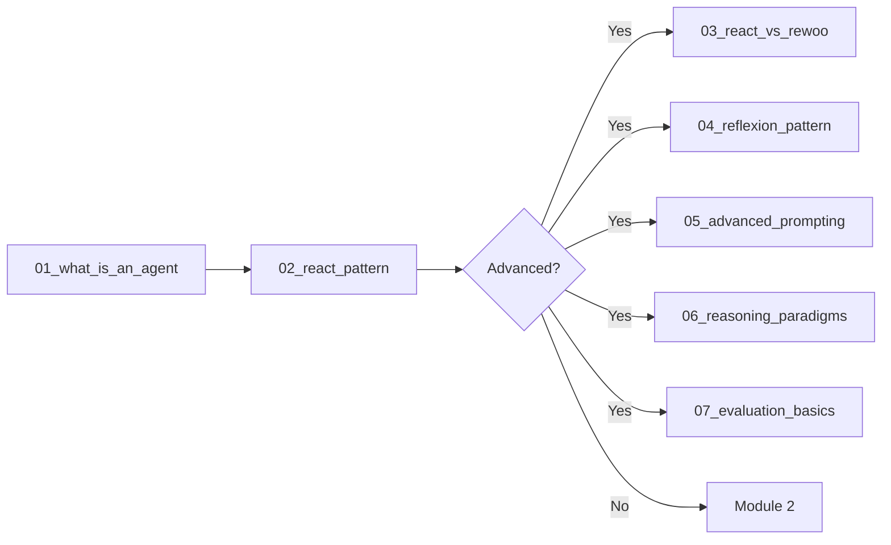

# Module 1: Agent Foundations & Advanced Theory

Welcome to Module 1 of the Agent Starter Kit! This module provides a comprehensive introduction to AI agents, from basic concepts to cutting-edge patterns from 2023-2025 research.

## 🎯 Module Overview

This module is designed as a progressive curriculum with two tracks:

### Foundation Track (Required - 45 minutes)
1. **What is an Agent?** (15 min) - Core concepts and architecture
2. **The ReAct Pattern** (30 min) - Building your first agent

### Advanced Track (Optional - 75 minutes)
3. **ReAct vs ReWOO** (15 min) - Token optimization strategies
4. **Reflexion Pattern** (15 min) - Verbal reinforcement learning
5. **Advanced Prompting** (20 min) - 2024-2025 techniques
6. **Reasoning Paradigms** (15 min) - CoT, ToT, Self-Consistency
7. **Evaluation Basics** (10 min) - Benchmarking and metrics

## 📚 Learning Path



## 🚀 Quick Start

1. **Setup Ollama** (if not already done):
   ```bash
   bash ../setup_ollama.sh
   ```

2. **Start with foundations**:
   - Open `01_what_is_an_agent.ipynb`
   - Follow along interactively
   - Complete the exercises

3. **Build your first agent**:
   - Open `02_react_pattern.ipynb`
   - Implement the ReAct loop
   - Test with different tasks

## 📖 Notebook Descriptions

### Foundation Notebooks

#### `01_what_is_an_agent.ipynb`
- **Concepts**: Agent vs chatbot spectrum, key properties, control loops
- **Theory**: Autonomy, goal-orientation, persistence, reactivity
- **Hands-on**: Analyze different AI systems, design agent architectures
- **Outcome**: Clear understanding of what makes a system "agentic"

#### `02_react_pattern.ipynb`
- **Concepts**: ReAct loop, state management, tool integration
- **Implementation**: Build complete agent from scratch with Ollama
- **Tools**: Calculator, search, memory tools
- **Outcome**: Working ReAct agent you can extend

### Advanced Notebooks

#### `03_react_vs_rewoo.ipynb`
- **Research**: ReWOO (Reasoning Without Observation) from 2024
- **Comparison**: ReAct vs ReWOO token usage (64% reduction!)
- **Implementation**: Both patterns side-by-side
- **Benchmark**: Measure tokens, latency, accuracy

#### `04_reflexion_pattern.ipynb`
- **Research**: Reflexion paper - verbal reinforcement learning
- **Concepts**: Self-reflection, episodic memory, linguistic feedback
- **Implementation**: Agent that improves through reflection
- **Results**: 91% pass@1 on HumanEval vs 80% baseline

#### `05_advanced_prompting.ipynb`
- **Research**: Prompt Report 2024 - 58 techniques
- **Techniques**: Active-Prompt, APE, Chain-of-Verification
- **Agent-specific**: Role-playing, capability templates
- **Hands-on**: A/B test different prompting strategies

#### `06_reasoning_paradigms.ipynb`
- **Patterns**: Chain-of-Thought → Tree-of-Thought → Graph-of-Thought
- **Implementation**: Visual reasoning traces
- **Comparison**: Performance on different task types
- **Advanced**: Algorithm-of-Thought for structured problems

#### `07_evaluation_basics.ipynb`
- **Metrics**: τ-bench pass@k, token efficiency, latency
- **Benchmarks**: Mini versions of GAIA, WebArena
- **Reality check**: Why agents achieve 24% vs human 92%
- **Tools**: Build your own evaluation framework

## 🎯 Learning Objectives

By completing this module, you will:

### Foundation Skills
- ✅ Distinguish between reactive and agentic systems
- ✅ Build a complete ReAct agent from first principles
- ✅ Integrate LLMs with tools effectively
- ✅ Debug agent behavior systematically

### Advanced Skills
- ✅ Implement cutting-edge agent patterns (ReWOO, Reflexion)
- ✅ Optimize token usage by 60%+ 
- ✅ Apply 2024-2025 prompting techniques
- ✅ Evaluate agents with modern benchmarks
- ✅ Understand why current agents achieve only 24% on real tasks

## 💡 Key Insights from Research

1. **Token Efficiency**: ReWOO reduces tokens by 64% while improving accuracy
2. **Self-Improvement**: Reflexion achieves 91% accuracy through verbal RL
3. **Reasoning Scale**: Tree-of-Thought improves sorting tasks by 62%
4. **Reality Gap**: Best agents complete only 24% of real workplace tasks
5. **Prompting Power**: Proper prompting improves task completion by 25-40%

## 🛠️ Exercises

Each notebook includes hands-on exercises:
- Build custom tools
- Implement new patterns
- Debug broken agents
- Optimize performance
- Create benchmarks

## 📊 Performance Benchmarks

We'll measure:
- **Token usage**: How many tokens each pattern uses
- **Latency**: Response time for different approaches  
- **Accuracy**: Success rate on standardized tasks
- **Reliability**: pass@k metrics from τ-bench
- **Cost**: Estimated API costs for cloud deployment

## 🚀 What's Next?

After completing Module 1:
- **Module 2**: Add sophisticated memory and learning systems
- **Module 3**: Master production tool integration
- **Module 4**: Build complex planning and multi-agent systems

## 📚 Additional Resources

### Papers
- [ReAct: Synergizing Reasoning and Acting](https://arxiv.org/abs/2210.03629)
- [ReWOO: Reasoning Without Observation](https://arxiv.org/abs/2305.18323)
- [Reflexion: Language Agents with Verbal Reinforcement Learning](https://arxiv.org/abs/2303.11366)
- [The Prompt Report: 58 LLM Prompting Techniques](https://arxiv.org/abs/2406.06608)

### Frameworks
- [Voyager: Lifelong Learning Agent](https://github.com/MineDojo/Voyager)
- [AutoGPT Original](https://github.com/Significant-Gravitas/AutoGPT)
- [Microsoft AutoGen](https://github.com/microsoft/autogen)

### Benchmarks
- [τ-bench: Tool-Agent-User Benchmark](https://github.com/sierra-research/tau-bench)
- [GAIA: General AI Assistants](https://huggingface.co/datasets/gaia-benchmark/GAIA)
- [WebArena: Web Agent Tasks](https://github.com/web-arena-x/webarena)

---

Ready to start? Open `01_what_is_an_agent.ipynb` and let's begin! 🚀