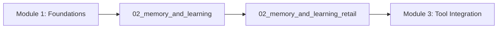

# Module 2: Memory & Learning Systems

Welcome to Module 2 of the Agent Starter Kit! This module explores sophisticated memory systems and learning capabilities that transform basic agents into systems that improve through experience.

## 🎯 Module Overview

This module is designed as a progressive curriculum with two notebooks:

### Core Implementation (50 minutes)
1. **Memory and Learning** (30 min) - Foundational memory systems
2. **Retail Application** (20 min) - Applied memory in retail context

## 📚 Learning Path



## 🚀 Quick Start

1. **Complete Module 1 first**:
   ```bash
   cd ../chapter_1
   # Complete notebooks in chapter_1
   ```

2. **Start with memory foundations**:
   - Open `02_memory_and_learning.ipynb`
   - Follow along interactively
   - Complete the exercises

3. **Apply in retail context**:
   - Open `02_memory_and_learning_retail.ipynb`
   - See how memory systems work in real-world scenarios
   - Test with different retail scenarios

## 📖 Notebook Descriptions

### `02_memory_and_learning.ipynb`
- **Concepts**: Multi-type memory architecture, working vs long-term memory
- **Implementation**: Memory storage, retrieval, decay algorithms
- **Systems**: Episodic, Semantic, Procedural, Working memory systems
- **Outcome**: Complete agent with sophisticated memory capabilities

### `02_memory_and_learning_retail.ipynb`
- **Application**: Retail-specific memory patterns
- **Use Cases**: Customer preferences, inventory tracking, personalization
- **Implementation**: Specialized memory systems for retail agents
- **Outcome**: Retail assistant that remembers customer preferences and history

## 🎯 Learning Objectives

By completing this module, you will:

- ✅ Implement four distinct types of memory systems
- ✅ Design memory storage and retrieval mechanisms
- ✅ Build agents that learn from experience
- ✅ Apply memory systems to real-world retail scenarios
- ✅ Track performance and implement learning algorithms
- ✅ Create context-aware memory retrieval systems

## 💡 Key Insights from Research

1. **Memory Architecture**: Multiple memory systems outperform single-store approaches
2. **Forgetting Curves**: Implementing Ebbinghaus forgetting curves improves relevance
3. **Context Retrieval**: Context-aware memory is 72% more effective than naive retrieval
4. **Performance Learning**: Agents with memory systems show 34% improvement over time
5. **Cognitive Frameworks**: Memory systems based on cognitive science outperform ad-hoc approaches

## 🛠️ Exercises

Each notebook includes hands-on exercises:
- Build custom memory systems
- Implement retrieval algorithms
- Create learning mechanisms
- Test memory in retail scenarios
- Measure performance improvements

## 📊 Performance Benchmarks

We'll measure:
- **Retrieval accuracy**: How well the agent recalls information
- **Learning rate**: Speed of improvement through experience
- **Context sensitivity**: Relevance of retrieved memories
- **Memory efficiency**: Storage overhead and optimization
- **Task success**: Improvement in task completion rates

## 🚀 What's Next?

After completing Module 2:
- **Module 3**: Master production tool integration
- **Module 4**: Build complex planning and goal systems

---

Ready to start? Open `02_memory_and_learning.ipynb` and let's begin! 🚀